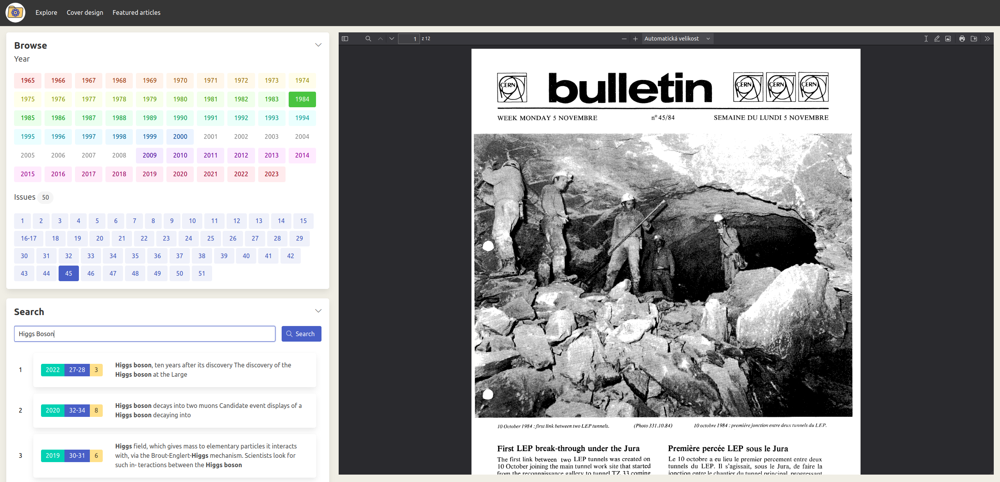

## CERN Bulletin Online Archive

### Live website [here](https://cern.ch/bulletin-archive)! (CERN network only)

### We already have [cds.cern.ch](https://cds.cern.ch), why this?

- 🌅 It's nicer ;)
- 🕵️ A lot of records on CDS are mislabeled making a lot of issues effectively unfindable
- 🚀 It has a fast and powerful full-text search - you can search for any text within the PDFs

### The tech

The app is built using Create React App and Python/flask. The full-text search is backed by Postgres (`ts_vector`/`ts_query`). The whole thing runs inside `uwsgi`.
